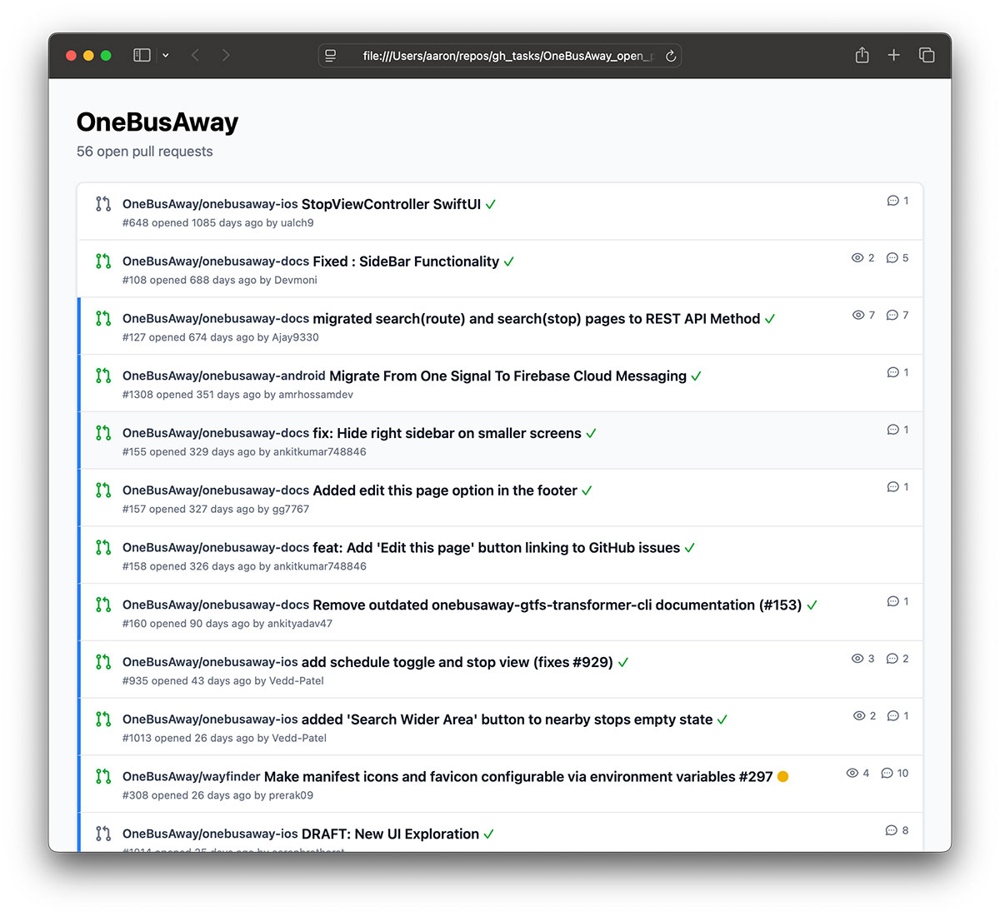

# About

Standalone Python script for GitHub organization management. The script is a self-contained [uv inline script](https://docs.astral.sh/uv/guides/scripts/#declaring-script-dependencies) with embedded dependencies — no virtual environment or `requirements.txt` needed.



## Prerequisites

- [uv](https://docs.astral.sh/uv/) (installs dependencies automatically on first run)
- Python 3.12+
- A GitHub personal access token with `repo` scope

Set your token in the environment or in a `.env` file:

```
GITHUB_TOKEN=ghp_xxx
```

## gh_review_queue.py

Lists all open pull requests for a GitHub organization, highlighting the PRs that require the attention of the person invoking the script.

### Usage

```
# Basic table output
./gh_review_queue.py OneBusAway

# HTML report
./gh_review_queue.py OneBusAway --output html

# Using a config file
./gh_review_queue.py --config settings.json

# Ignore specific repos
./gh_review_queue.py OneBusAway --ignore "repo-a, repo-b"
```

### Options

| Flag | Description |
|------|-------------|
| `org` | GitHub organization name (positional) |
| `--config <file>` | JSON config file (keys: `org`, `output`, `ignore`) |
| `--output html` | Generate a Tailwind-styled HTML report (`<org>_review_queue.html`) |
| `--ignore <list>` | Comma-separated repo names to exclude |

CLI arguments override config file values.

### Config file

```json
{
  "org": "MyOrg",
  "output": "html",
  "ignore": ["repo-a", "repo-b"]
}
```

### HTML report features

- PR status icons (draft, CI state, labels)
- Review and comment counts
- **"Needs attention" indicators** — PRs that need your review get a blue left border. A PR needs attention if:
  - You are a requested reviewer
  - The PR has zero reviews from anyone
  - New commits have been pushed since your last review
- Attention indicators dismiss automatically when you click through to a PR (persisted via localStorage)
- PRs needing attention are sorted to the top

## License: Apache 2.0

See [LICENSE](LICENSE).